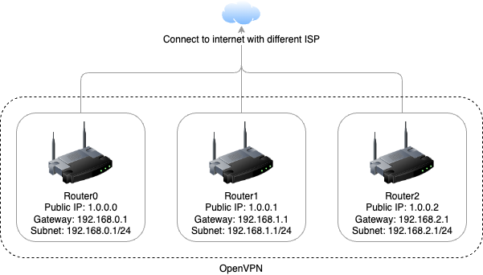

# Connect multiple Asus routers via OpenVPN

## Prepare

This guide is to discuss how to connect multiple Asus routers via OpenVPN. In general, other brand routers should also work fine with OpenVPN if they support it in their official firmware. If not, it should be a little difficult to install third-party firmware like OpenWrt or Padavan for someone not familiar with them. After all, I'll use Asus's official firmware in this guide. Please let me know if you need other firmware guides.

First, let's say we have 3 routers named router0, router1 and router2. And each of them has a different ISP connected. Networking settings show in the image below. Remember those network settings are made up for convenience. Put your setting into the router's dashboard.

- Router0's public IP is 1.0.0.0, the gateway is 192.168.0.1 and the subnet is 192.168.0.1/24.
- Router1's public IP is 1.0.0.1, the gateway is 192.168.1.1 and the subnet is 192.168.1.1/24.
- Router2's public IP is 1.0.0.2, the gateway is 192.168.2.1 and the subnet is 192.168.2.1/24.

In this guide, not all routers need to have public IP. But do need one for the server. For example, if router0 has a public IP, and others don't. Then, router0 will be set as an OpenVPN server, others are OpenVPN clients.

## DDNS(optional)

Unfortunately, some ISP don't provide static public IP freely or even don't provide dynamic public IP. There are 3 cases.

1. If you have a static public IP, you don't need this part.
2. If you have a dynamic public IP, you need to keep reading this part.
3. If you have no public IP, please talk to your ISP or use frp/ngrok to get your service exposed to public. And this guide may not fit your situation.

DDNS is Dynamic DNS, which can dynamically update DNS records without the need for human interaction. If your public IP changes, the DNS of your domain keeps updating automatically.

As I said before, we're using Asus's official firmware. We're going to use DDNS provided by Asus which is free.

#todo

## Config on server

## Config on client