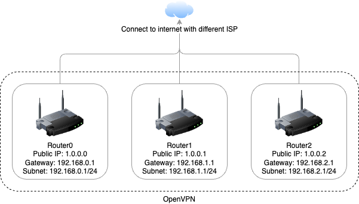
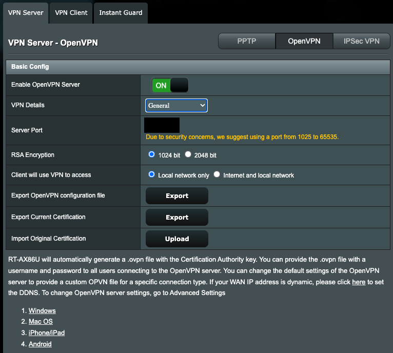
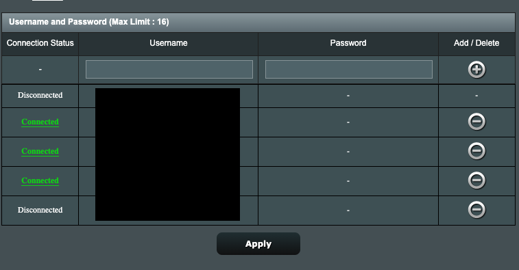
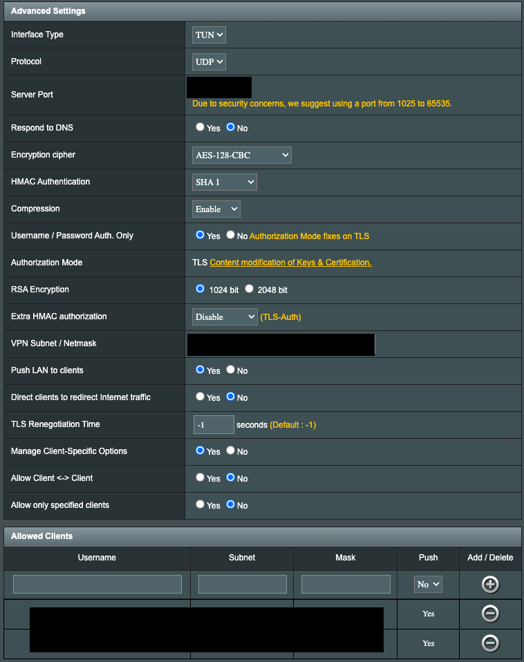

# Connect multiple Asus routers via OpenVPN

## Prepare

This guide is to discuss how to connect multiple Asus routers via OpenVPN. In general, other brand routers should also work fine with OpenVPN if they support it in their official firmware. If not, it should be a little difficult to install third-party firmware like OpenWrt or Padavan for someone not familiar with them. After all, I'll use Asus's official firmware in this guide. Please let me know if you need other firmware guides.

First, let's say we have 3 routers named router0, router1 and router2. And each of them has a different ISP connected. Networking settings show in the image below. Remember those network settings are made up for convenience. Put your setting into the router's dashboard.



- Router0's public IP is 1.0.0.0, the gateway is 192.168.0.1 and the subnet is 192.168.0.1/24.
- Router1's public IP is 1.0.0.1, the gateway is 192.168.1.1 and the subnet is 192.168.1.1/24.
- Router2's public IP is 1.0.0.2, the gateway is 192.168.2.1 and the subnet is 192.168.2.1/24.

In this guide, not all routers need to have public IPs. But do need one for the server. For example, if router0 has a public IP, and others don't. Then, router0 will be set as an OpenVPN server, others are OpenVPN clients.

## DDNS(optional)

Unfortunately, some ISP don't provide static public IP freely or even don't provide dynamic public IP. There are 3 cases.

1. If you have a static public IP, you don't need this part.
2. If you have a dynamic public IP, you need to keep reading this part.
3. If you have no public IP, please talk to your ISP or use frp/ngrok to get your service exposed to the public. And this guide may not fit your situation.

DDNS is Dynamic DNS, which can dynamically update DNS records without the need for human interaction. If your public IP changes, the DNS of your domain keeps updating automatically.

As I said before, we're using Asus's official firmware. We're going to use DDNS provided by Asus which is free.

Find **WAN** under advanced settings, and choose **DDNS** tab. By default, the **Server** choice is `WWW.ASUS.COM`. If not, select it. Enter the domain you want into the **Host Name** box then click **Register**. In this screenshot, I have registered, so it shows **Deregister** button. If the domain name you want is already registered, then it will indicate a failure. You can only choose an alternative domain name that is not registered. [http://iplookup.asus.com/nslookup.php](http://iplookup.asus.com/nslookup.php) is a quick way to test if your domain is taken.


If everything goes well, a domain has been created and pointed to your router's public IP. Let's say the domain is `example.asuscomm.com`.

## Config on server

Find **VPN** under advanced settings. And choose **VPN Server** and **OpenVPN**.

The only thing that needs to do here is to set the server port to whatever you like. Let's say set **10000** as the server port for example.



Then scroll down and add the client's username and password. In this guide, we have other 2 routers as clients. So add 2 accounts here.

- username: router1, password: router1password
- username: router2, password: router2password

Don't forget to click the **Apply** button, if not the config won't be activated.



Then go do **VPN Details** and change **General** to **Advanced Setings**, you will find more settings.

There are 4 things to do: 

1. Check if the **Server Port** is the one you set before.
2. Change **Username / Password Auth. Only** from **No** to **Yes**
3. Change the **VPN Subnet / Netmask, keeping the default is acceptable.
4. Add client routers into **Allowed Clients**.
    - username: router1, subnet: 192.168.1.1, mask: 255.255.255.0
    - username: router2, subnet: 192.168.2.1, mask: 255.255.255.0




Then you need to export client's config. Change **VPN Details** from **Advanced Settings** to **General**. And click **export** of **Export OpenVPN configuration file**. You will get a config file named `client.ovpn` by default. Then open this file and look at the first line. By default it will look like this:
```
remote 1.1.1.1(you public ip)
```
Change `1.1.1.1` to your DDNS domain/url like `example.asuscomm.com`.

## Config on client

It's easy on client's side. Just go to VPN page choose **VPN Client** -> **Add profile** -> Input **Username**, **Password** and upload your modified `client.ovpn`. Click **OK** and if this file is not activated click **Activate**

## In the end

Everything is done, enjoy your custom sd-wan.

If you encounter any problems following this tutorial, feel free to leave a comment.